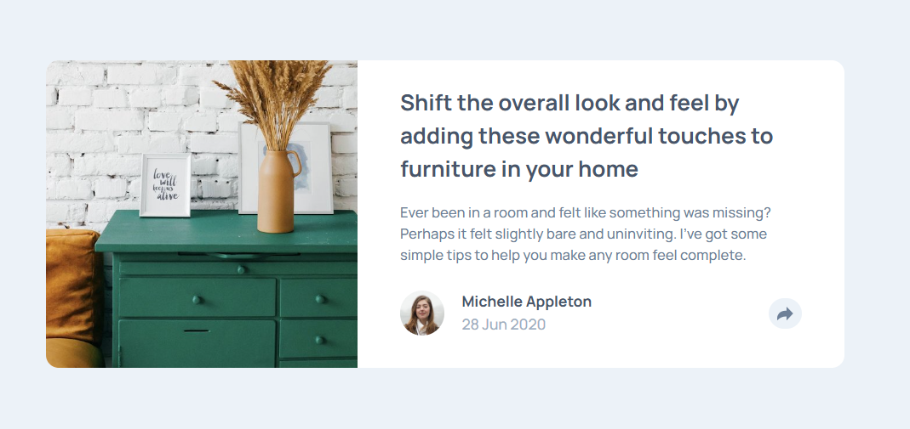

# Frontend Mentor - Article preview component solution

This is a solution to the [Article preview component challenge on Frontend Mentor](https://www.frontendmentor.io/challenges/article-preview-component-dYBN_pYFT). Frontend Mentor challenges help you improve your coding skills by building realistic projects.

## Table of contents

- [Overview](#overview)
  - [The challenge](#the-challenge)
  - [Screenshot](#screenshot)
  - [Links](#links)
- [My process](#my-process)
  - [Built with](#built-with)
  - [What I learned](#what-i-learned)
  - [Continued development](#continued-development)
  - [Useful resources](#useful-resources)
  - [AI Collaboration](#ai-collaboration)
- [Author](#author)

## Overview

### The challenge

Users should be able to:

- View the optimal layout for the component depending on their device's screen size
- See the social media share links when they click the share icon

### Screenshot



### Links

- Solution URL: [Add solution URL here](https://github.com/denissoboslai13/frontend-mentor-article-preview/tree/main/component-solution)
- Live Site URL: [Add live site URL here](https://denissoboslai13.github.io/frontend-mentor-article-preview/)

## My process

### Built with

- Semantic HTML5 markup
- CSS custom properties
- Flexbox
- CSS Grid
- Mobile-first workflow
- Tailwind CSS
- [React](https://reactjs.org/) - JS library
- [Motion](https://motion.dev/) - Used for animations

### What I learned

Okay, i had quite a bit of fun with this, finally working in react like im used to, and im happy with the result. The only real challenge was figuring out the svgs, since if you use image tags you cant recolor them, but the challenge actively asks you to recolor them, so i had to figure out how to use them. I also learned how to figure out the size of your screen in react, which is pretty cool.

```tsx
<ShareIcon
  className={`${visibility === 1 && isDesktop ? "[&_path]:fill-white" : "fill-auto"}`}
/>
```

```tsx
const isDesktop = useMediaQuery({ query: "(min-width: 768px)" });
const imdobile = useMediaQuery({ query: "(max-width: 767px)" });
```

### Continued development

I found this fun, added my own animations using motion which i have experience with, so i hope the future challenges just build on this, id quite like that.

### Useful resources

- [Tailwind Docs](https://tailwindcss.com/) - Yeah still just tailwind docs, since i have quite a bit of experience with react i didnt need really use anything else

### AI Collaboration

Alright, sadly i did have to use Claude once more to help me with the svgs, but im not sure i wouldve figured it out without that help. I only needed it for the svgs, since you cant color images (unless using filter but that felt a bit cheap), so then i tried just the normal import ReactComponent as xyz from xyz, but since i used vite, that also didnt work. So then it suggested vite-plugin-svgr, with which i was able to do it.

## Author

- Frontend Mentor - [@denissoboslai13](https://www.frontendmentor.io/profile/denissoboslai13)
